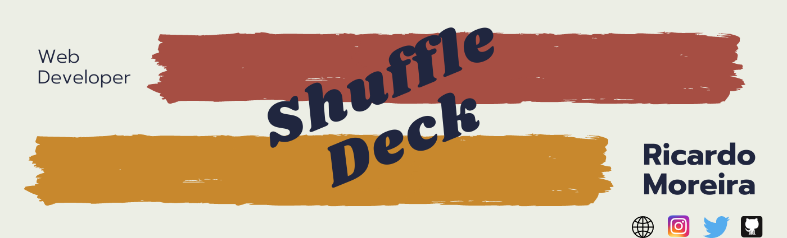
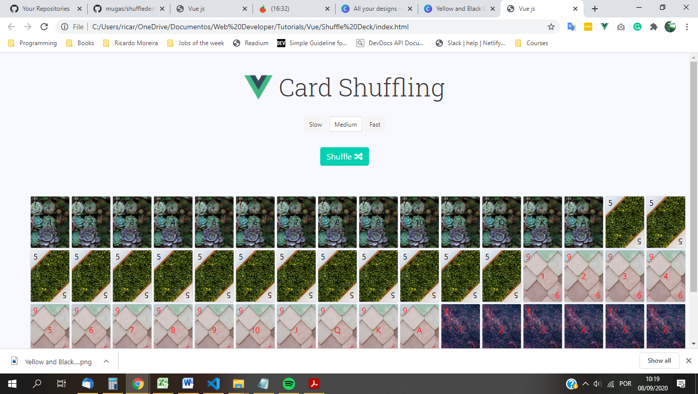
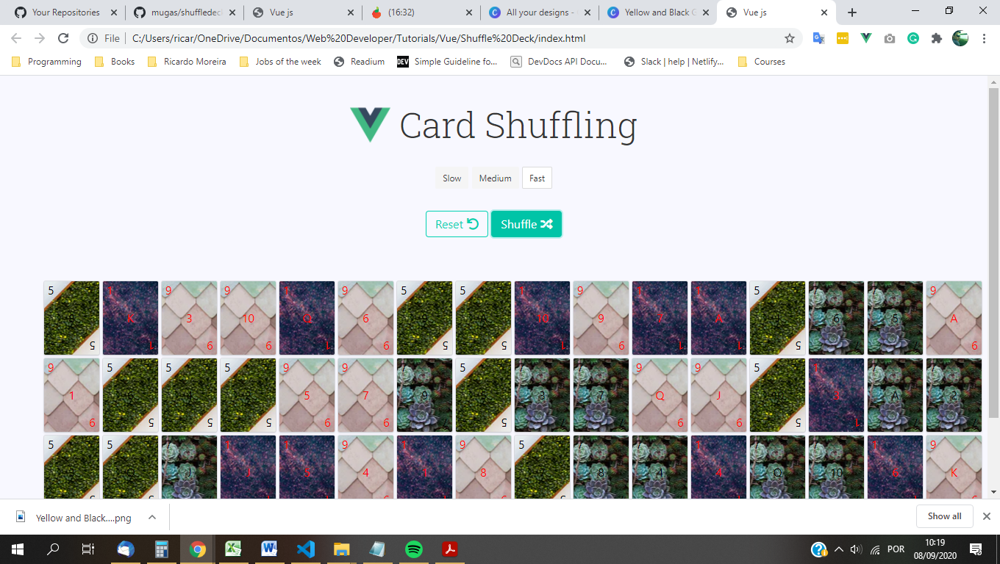

<h1 align="center"> 🔥Shuffle Deck🔥</h1>

<h2 align="center"> How to shuffle a deck using Vue </h2>

### Index

* [Name](#Name) 👈
* [Links](#Links) 🔗
* [Description](#Description) 📖
* [Languages and Frameworks](####Languages-and-Frameworks) ⚙️
* [Screenshots](#Screenshots) 📱
* [Instalation](#Instalation) 🧩
* [Support](#Support) 🆘
* [Roadmap](#Roadmap) 🗺️
* [Authors and acknowledgment](####Authors-and-acknowledgment) ✍️
* [Project Status](#Project-Status) 📜

# Name

Shuffle Deck

# Links

[Website](https://deckshuffle.netlify.app/)

___

# Description

A vue.js application with a deck of cards made from a tutorial.
Add some changes, like the deck and some of the transitions.

* **Vue transitions**
* **Vue Instance**
* **Working with Font Awesome**
* **Working with Bulma**
  
___

# Languages, Frameworks and others

* **Vue.js** - Framework

____

# Screenshots

Home Page         |  Blog Page
:-------------------------:|:-------------------------:
  |  

____

# Instalation

___

# Support

Have any questions or find something that doesn't look good? Let's talk 😊

[Here](https://github.com/mugas)

[And Here](https://www.ricardomoreira.io/about)

____

# Roadmap

Nothing to add

____

# Authors-and-acknowledgment

* [Based on this](https://medium.com/fullstackio/tutorial-shuffle-a-deck-of-cards-in-vue-js-b65da4c59b1)

* Me 😊

____

# Project-Status  

Done.

____
